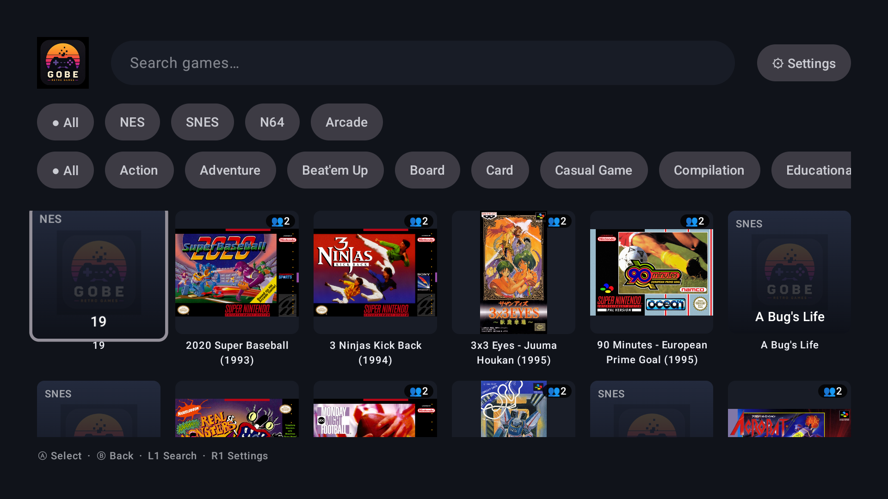
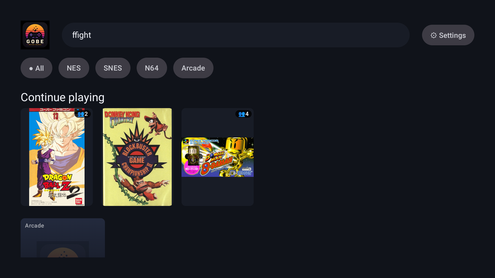
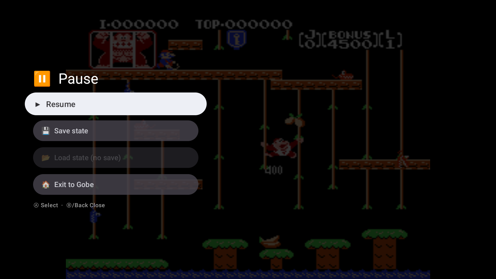
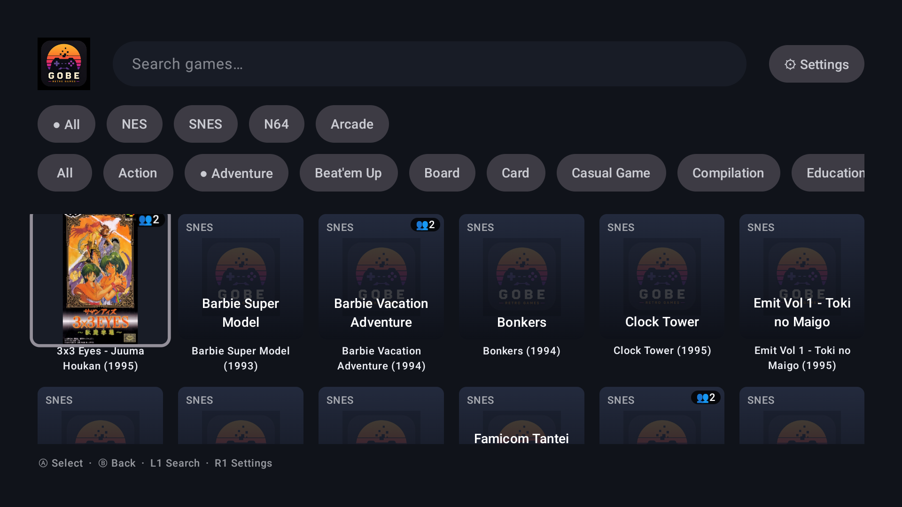
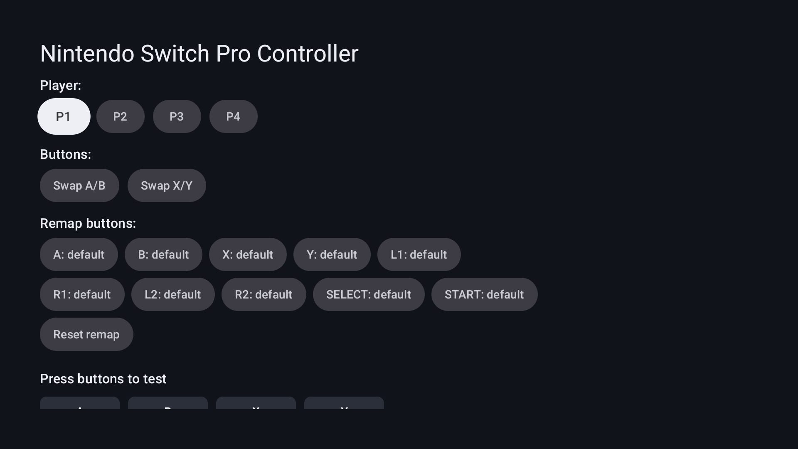

<div align="center">

# 🎮 Gobe

**An all-in-one Libretro emulator frontend for Android TV.**

Browse your retro library with box art and play SNES, Arcade and NES/Famicom Disk System games
from your couch — built natively in Kotlin + Jetpack Compose for TV.


</div>

> **Beta.** Gobe is an early, working build tested on an ONN Google TV 4K Plus (`armeabi-v7a`).
> It does **not** include any games or BIOS files — you provide your own (see below).

---

## Screenshots

| Home (box-art grid + filters) | Game detail | In-game |
|---|---|---|
|  |  |  |

| Browse by genre | Controller setup |
|---|---|
|  |  |

## Features

- **Emulation** (via [LibretroDroid](https://github.com/Swordfish90/LibretroDroid)):
  - **SNES** (snes9x)
  - **Arcade** (FBNeo)
  - **NES / Famicom Disk System** (FCEUmm) — `.fds` supported (needs the FDS BIOS, see below)
- **Library**: automatic ROM scanning, a searchable **box-art grid** (art from the
  [libretro-thumbnails](https://github.com/libretro-thumbnails) repos), filter by **system** and
  **genre**, a **Continue playing** row, and per-game metadata (players / genre / year).
- **In-game**: save states + SRAM, a pause menu (Save / Load / Exit), and an on-launch controls hint.
  Open the menu with **Select + Start** (or Back).
- **Controllers**: detect connected gamepads with a live button test, assign each controller to a
  **player (P1–P4)**, quick **Swap A/B / X/Y**, and full **button remapping by capture** — all
  per-controller and saved.
- **Navigation**: gamepad shortcuts (**L1** → search, **R1** → settings) with an on-screen legend.
- **Languages**: English and Spanish.

## Install

1. Download the latest `app-release.apk` from the [**Releases**](../../releases) page.
2. Sideload it onto your Android TV device (e.g. via [Downloader], a USB drive, or
   `adb install app-release.apk`).
3. On first launch, grant the **all-files access** permission so Gobe can find your ROMs.

> **Updating from an earlier build:** the beta APK is signed with Gobe's release key. If you had a
> development (debug) build installed, uninstall it first — Android won't update across different
> signing keys. From v0.1.0 onward, releases update in place.

[Downloader]: https://www.aftvnews.com/downloader/

## Setup: your ROMs & BIOS

Gobe ships **no games or BIOS**. Put your own legally-obtained files on the device:

- **ROMs**: default folder `Download/ROMs/` (add more folders in **Settings → ROM folders**). Gobe
  recognizes: SNES (`.smc`/`.sfc`), Arcade (`.zip`), NES/FDS (`.nes`/`.fds`).
- **BIOS** (only for Famicom Disk System): put **`disksys.rom`** in
  `Download/ROMs/system/`. Without it, `.fds` games won't boot.
- **Arcade**: your `.zip` romsets must match the FBNeo set; missing files show an on-screen "FBNeo
  Error" naming the file to add.

## Controllers

**Settings → Controllers** lists connected gamepads. Select one to:
- assign it to a **player** (P1–P4) — input is routed to that port,
- **Swap A/B / X/Y** (handy for Nintendo-layout pads),
- **remap any button** by capture ("press the button for A…").

> **Note:** on some Android TV boxes (including the ONN) the single USB-C port is power-only and
> does **not** act as a USB host, so **USB controllers may not be detected** — use **Bluetooth**,
> which is the reliable path for one or more controllers.

## Building from source

```bash
./gradlew :app:assembleDebug      # debug build
./gradlew :app:assembleRelease    # signed release (needs keystore.properties + the keystore)
./gradlew :app:testDebugUnitTest  # unit tests
```

The release build reads signing config from a **gitignored** `keystore.properties` in the repo root
(`storeFile` / `storePassword` / `keyAlias` / `keyPassword`). Without it, the release build is
produced unsigned. The Libretro cores are bundled as `armeabi-v7a` `.so` files under
`app/src/main/jniLibs/`.

## Tech stack

Kotlin · Jetpack Compose for **TV** (`androidx.tv:tv-material3`) · Room · Coil · Kotlin Coroutines ·
[LibretroDroid] 0.14.0 · minSdk 30 / targetSdk 34.

[LibretroDroid]: https://github.com/Swordfish90/LibretroDroid

## Roadmap

See [ROADMAP.md](ROADMAP.md). Next up (v0.2): unassign-controller, analog deadzone, configurable
menu hotkey, FDS multi-disk swap.

## Known limitations

- Tested on a single device (ONN Google TV 4K Plus, 32-bit `armeabi-v7a`).
- **USB controllers**: not detected on the ONN (hardware — its USB-C is power-only). Use Bluetooth.
- **Rumble** is not available on this hardware.
- **FDS multi-disk** games needing a manual side flip have no disk-swap UI yet.
- A couple of arcade titles need a specific file inside their `.zip` (FBNeo names it on screen).

## Legal

Gobe is a personal, non-commercial project. It **bundles GPL-licensed Libretro cores** and is
therefore released under the **GPLv3** (see [LICENSE](LICENSE)). It **does not distribute any game
ROMs or BIOS** — you must supply your own, legally-obtained files. Trademarks and game content
belong to their respective owners.

## Credits

Built on [LibretroDroid] and the Libretro ecosystem (cores + [thumbnails] + database).

[thumbnails]: https://github.com/libretro-thumbnails
